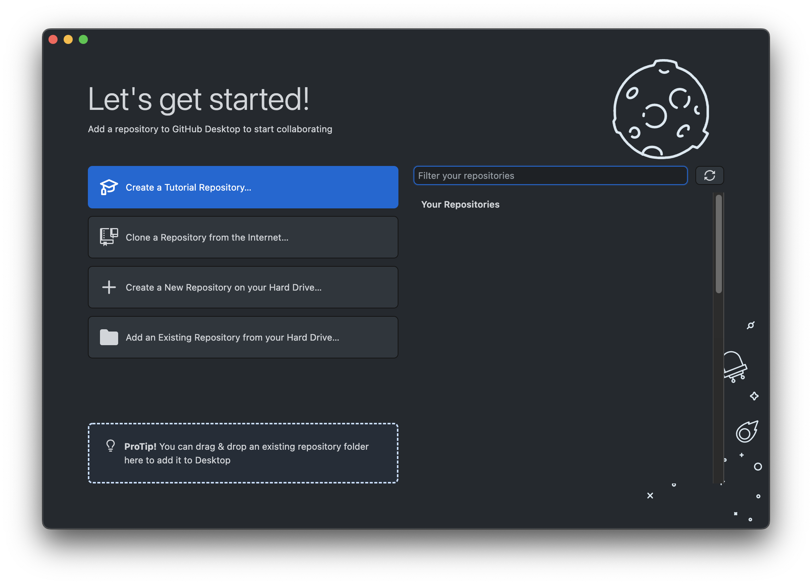

# What is Git anyways?

Git is *version control software*. It basically allows you to keep track of your code at different points in time (like Google Docs edit history). Git (in combination with other tools like GitHub) allows developers to work together in codebases.

Each saved snapshot of your code is called a *commit*. Frequent commits allow developers to navigate their codebases at different points in time, which can be very useful. For example, let's say some new code introduced a bug into a program. Developers can compare their current code with the code in previous commits to figure out what caused the bug and can even choose to rollback to a previous version (like Ctrl-Z but on steroids).

# Installing Git

1. Go to [this website](https://git-scm.com/downloads) and download the installer for your OS.

2. Click through each step, leaving the default options.

3. Open up the Command Prompt (Windows) or Terminal (Mac/Linux) and type in `git --version`. You should see something like `git version 2.25.1`.

4. If you see “command not found” or a similar error message, refer to
this [link](https://techdirectarchive.com/2022/07/12/git-command-not-found-how-to-fix-git-is-not-recognized-as-an-internal-or-external-command/#:~:text=If%20you%20opened%20Command%20Prompt,reopening%20it%20as%20an%20administrator.).

# Git Basics

There are various ways to use Git that may be worth looking at!

1. [Through the command line](#command-line). This will work on any computer as long it has Git installed, but it have a bit of a difficulty curve because there isn't a graphical interface like you may be used to.
2. [Through GitHub Desktop](#github-desktop). This requires that [GitHub Desktop](https://desktop.github.com) is also installed, but it'll have a GUI.

# Command Line

## Initializing the repository

If you're starting on a **new project**, you have to initialize the repository. If you are cloning another repository's code, you do not need to initialize the folder.

To initialize, in your terminal, navigate to the directory (folder) with your code (`cd <directory>`).

Initialize a git repository using the `git init` command.

## Committing

When you make changes to your code, you can commit (you don't have to commit too frequently, but more frequent commits are usually better).

First, add the changed files. You can figure out what files have been
changed by using the command `git status`.

```bash
foo@bar:~$ git status
On branch master

No commits yet

Untracked files:
  (use "git add <file>..." to include in what will be committed)
        test.txt

nothing added to commit but untracked files present (use "git add" to track)
```

In this case, I've created the file `test.txt`, but haven't added it yet.
To add it, I run `git add test.txt`.

```bash
foo@bar:~$ git add test.txt
```

You can also use `git add *` to add everything in your folder.

Now, I can finally commit. Use the following command
`git commit -m "Commit message"`. Include a short commit message
to describe the changes.

```bash
foo@bar:~$ git commit -m "Add test.txt"
[master (root-commit) 61d527b] Add test.txt
 1 file changed, 1 insertion(+)
 create mode 100644 test.txt
```

**NOTE**: You may have to run the following commands before committing:

```bash
foo@bar:~$ git config --global user.email "[your GitHub email]"
foo@bar:~$ git config --global user.name "[your GitHub username]"
```

## Pushing

Committing will only add your changes to your copy of the repository on your computer (the local repo). If you want those changes to appear on GitHub (the remote repo), you need to **push** those changes.

After you have committed changes, you can run `git push` to push those changes to the remote repo.

```bash
foo@bar:~$ git push
Enumerating objects: 1, done.
Counting objects: 100% (1/1), done.
Writing objects: 100% (1/1), 381 bytes | 381.00 KiB/s, done.
Total 1 (delta 0), reused 0 (delta 0), pack-reused 0
To ../test-remote
   020c3d6..917b717  main -> main
```

# GitHub Desktop

GitHub Desktop has a tutorial specifically on how to use Git! :tada:

Once you log into GitHub Desktop, you'll be prompted with this screen:


From here, you can click the "Create a Tutorial Repository..." to try out the tutorial.
