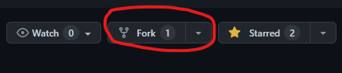
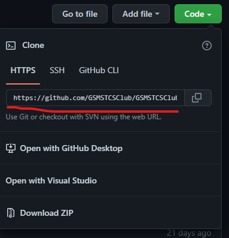
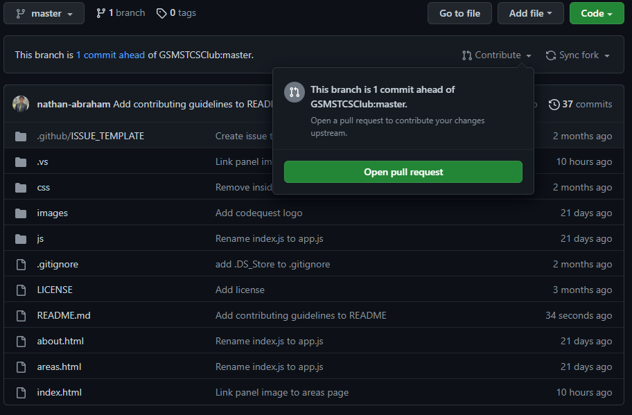
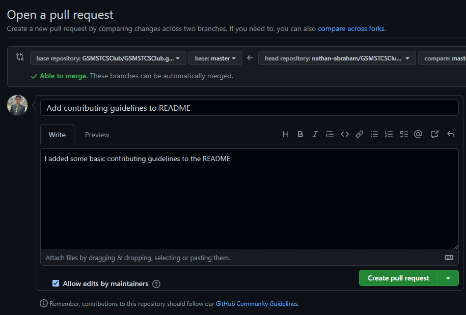

# Contributing to the Website

Go to a the website's
[GitHub Repo](https://github.com/GSMSTCSClub/GSMSTCSClub.github.io) and
click the fork button (give it a star while you're at it ⭐)

Clone your forked repo by typing in `git clone <url>` in your terminal.
Get the url by clicking the green Code button.

Your clone repo is automatically set up with git. Now, you can make
whatever changes you want (fixing typos, adding new content, etc.)
and commit. If you need help on commiting, check out
[installing_git_and_basics.md](./installing_git_and_basics.md).

After you've made all of your commits, push your changes to your forked
repo with the command `git push`.

When you revisit the GitHub page of your fork, it should reflect your
changes. Now, you can open a pull request by clicking this button
(under the dropdown menu titled "Contribute")

Write a short message explaining your changes. When you are done,
click the `Create pull request` button!
